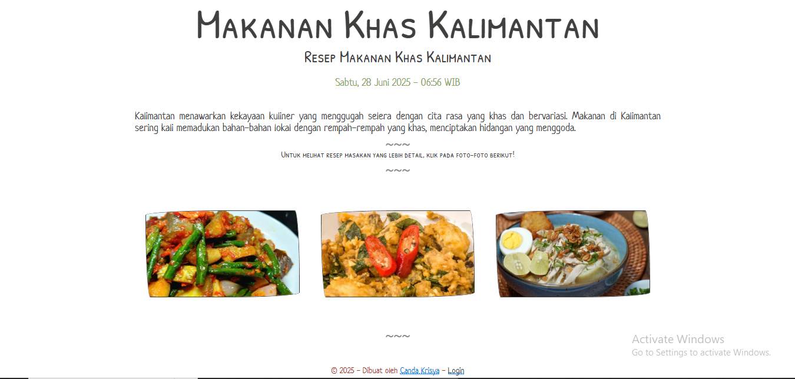
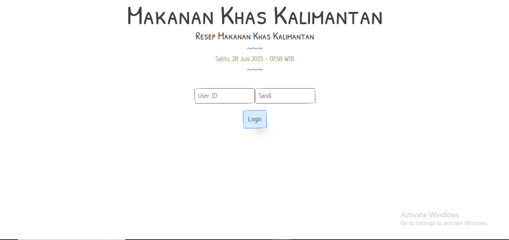
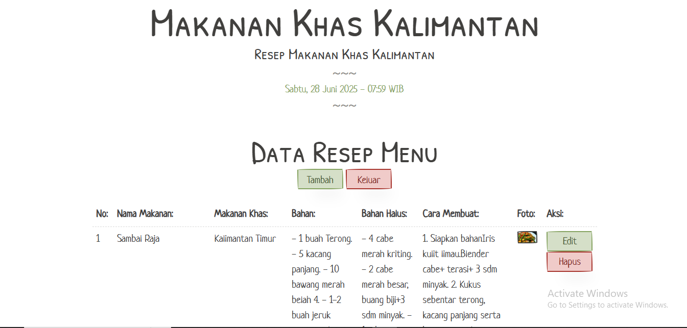
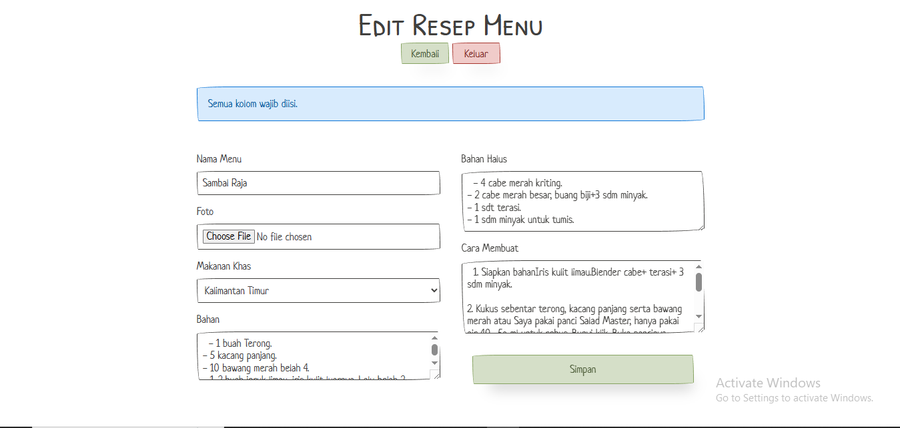
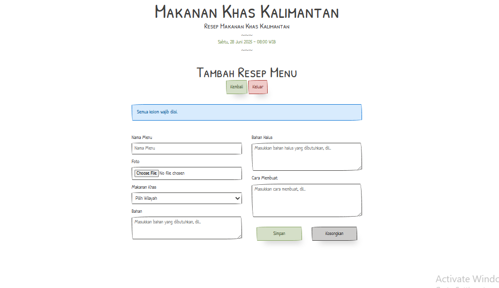

# Aplikasi Resep Makanan Khas Kalimantan

Aplikasi Resep Makanan Khas Kalimantan adalah sebuah sistem berbasis web sederhana yang menampilkan berbagai resep masakan khas dari berbagai wilayah di Kalimantan. Aplikasi ini memungkinkan pengguna untuk melihat detail resep, termasuk bahan, bumbu halus, dan cara pembuatannya. Tersedia juga halaman admin untuk pengelolaan data resep.

## Deskripsi Proyek
Aplikasi Resep Makanan Khas Kalimantan adalah sebuah sistem berbasis web sederhana yang menampilkan berbagai resep masakan khas dari berbagai wilayah di Kalimantan. Aplikasi ini memungkinkan pengguna untuk melihat detail resep, termasuk bahan, bumbu halus, dan cara pembuatannya. Tersedia juga halaman admin untuk pengelolaan data resep.

## Deskripsi Proyek

Proyek "Aplikasi Resep Makanan Khas Kalimantan" bertujuan untuk mendokumentasikan dan menyajikan berbagai resep kuliner tradisional dari Kalimantan. Aplikasi ini dirancang agar mudah digunakan oleh siapa saja yang tertarik untuk belajar dan mencoba memasak hidangan khas daerah tersebut. Pengguna dapat menelusuri koleksi resep yang tersedia, melihat detail lengkapnya, dan bagi administrator, aplikasi ini menyediakan antarmuka untuk mengelola data resep.

## Teknologi yang Digunakan

- **Bahasa Pemrograman:** PHP
- **Database:** MySQL
- **Web Server:** Apache / Nginx (menggunakan Laragon sebagai lingkungan pengembangan)
- **Framework/Library CSS:** PaperCSS
- **Manajemen Database:** Adminer
- **Lingkungan Pengembangan Lokal:** Laragon

## Fitur Utama dan Tambahan

### Fitur Utama

- **Tampilan Resep:** Menampilkan daftar resep makanan khas Kalimantan di halaman utama dengan gambar masing-masing resep, memberikan gambaran visual masakan.
- **Detail Resep:** Pengguna dapat mengklik pada gambar resep di halaman utama untuk melihat informasi lengkap tentang suatu resep, meliputi:
  - Nama Masakan
  - Asal Wilayah
  - Daftar Bahan
  - Daftar Bahan Halus/Bumbu
  - Cara Membuat
  - Foto Masakan

### Fitur Tambahan

- **Waktu Dinamis:** Menampilkan tanggal dan waktu saat ini (contoh: "Sabtu, 28 Juni 2025 - 07:19 WIB") secara real-time di bagian header aplikasi.
- **Deskripsi Aplikasi Singkat:** Halaman utama memiliki bagian deskripsi singkat mengenai kekayaan kuliner Kalimantan.
- **Halaman Admin:** Menyediakan antarmuka terpisah untuk pengelolaan data resep dengan fitur-fitur berikut:
  - **Login Admin:** Sistem login untuk mengamankan akses ke halaman administrasi.
  - **Daftar Resep:** Menampilkan semua resep dalam format tabel yang mudah dibaca.
  - **Tambah Resep:** Formulir untuk menambahkan resep masakan baru ke database.
  - **Edit Resep:** Opsi untuk mengubah detail resep yang sudah ada.
  - **Hapus Resep:** Fungsi untuk menghapus resep dari database.

## Cara Menjalankan Aplikasi

Ikuti langkah-langkah di bawah ini untuk menjalankan aplikasi menggunakan Laragon:

### 1. Unduh dan Instal Laragon

Jika Anda belum memiliki Laragon, unduh dan instal dari situs resmi: [https://laragon.org/](https://laragon.org/)

### 2. Kloning Repositori

- Jika aplikasi Anda berada di repositori Git, kloning repositori ke folder `www` di instalasi Laragon Anda (biasanya `C:\laragon\www`).
  ```bash
  git clone <URL_REPOSITORI_ANDA> C:\laragon\www\resep-makanan
  ```
  Ganti `<URL_REPOSITORI_ANDA>` dengan URL repositori Git Anda dan `resep-makanan` dengan nama folder yang Anda inginkan.
- Jika Anda memiliki file aplikasi secara lokal, salin semua file aplikasi ke dalam folder baru di `C:\laragon\www`, misalnya `C:\laragon\www\resep-makanan`.
- 
### 3. Login Admin

    - Akses halaman login admin: `http://localhost/Resep%20Makanan/admin/index.php` 
    - User ID: `admin`
    - Sandi: `01admin` (password plain text yang Anda hash ke database)
    
### 4. Konfigurasi Database

Aplikasi ini menggunakan database MySQL dengan skema berikut:

```sql
SET NAMES utf8;
SET time_zone = '+00:00';
SET foreign_key_checks = 0;
SET sql_mode = 'NO_AUTO_VALUE_ON_ZERO';

DROP TABLE IF EXISTS `menu`;
CREATE TABLE `menu` (
  `id_menu` int NOT NULL AUTO_INCREMENT COMMENT 'ID menu',
  `nama_menu` varchar(100) CHARACTER SET utf32 COLLATE utf32_estonian_ci NOT NULL COMMENT 'Nama menu',
  `id_wilayah` int NOT NULL COMMENT 'ID wilayah',
  `bahan` text CHARACTER SET utf32 COLLATE utf32_estonian_ci NOT NULL COMMENT 'Resep bahan',
  `bahan_halus` text CHARACTER SET utf32 COLLATE utf32_estonian_ci NOT NULL COMMENT 'Resep bumbu',
  `cara_membuat` text CHARACTER SET utf32 COLLATE utf32_estonian_ci NOT NULL COMMENT 'Cara membuat',
  `foto` varchar(100) CHARACTER SET utf32 COLLATE utf32_estonian_ci NOT NULL COMMENT 'Foto masakan',
  PRIMARY KEY (`id_menu`),
  KEY `id_wilayah` (`id_wilayah`)
) ENGINE=MyISAM DEFAULT CHARSET=utf32 COLLATE=utf32_estonian_ci;


DROP TABLE IF EXISTS `pengguna`;
CREATE TABLE `pengguna` (
  `user_id` varchar(10) NOT NULL COMMENT 'ID pengguna',
  `sandi` varchar(100) NOT NULL COMMENT 'Sandi pengguna',
  `nama_pengguna` varchar(40) NOT NULL COMMENT 'Nama pengguna'
) ENGINE=InnoDB DEFAULT CHARSET=utf32;


DROP VIEW IF EXISTS `view_resep_menu`;
CREATE TABLE `view_resep_menu` (`id_menu` int, `nama_menu` varchar(100), `id_wilayah` int, `nama_wilayah` varchar(30), `bahan` text, `bahan_halus` text, `cara_membuat` text, `foto` varchar(100));


DROP TABLE IF EXISTS `wilayah`;
CREATE TABLE `wilayah` (
  `id_wilayah` int NOT NULL AUTO_INCREMENT COMMENT 'Id wilayah',
  `nama_wilayah` varchar(30) NOT NULL COMMENT 'Nama wilayah',
  PRIMARY KEY (`id_wilayah`)
) ENGINE=InnoDB DEFAULT CHARSET=utf32;


DROP TABLE IF EXISTS `view_resep_menu`;
CREATE ALGORITHM=UNDEFINED SQL SECURITY DEFINER VIEW `view_resep_menu` AS select `m`.`id_menu` AS `id_menu`,`m`.`nama_menu` AS `nama_menu`,`m`.`id_wilayah` AS `id_wilayah`,`w`.`nama_wilayah` AS `nama_wilayah`,`m`.`bahan` AS `bahan`,`m`.`bahan_halus` AS `bahan_halus`,`m`.`cara_membuat` AS `cara_membuat`,`m`.`foto` AS `foto` from (`menu` `m` join `wilayah` `w`) where (`m`.`id_wilayah` = `w`.`id_wilayah`);

## Screenshot Aplikasi

- Form utama

- Form login

- Form admin

- Form edit

- Form  tambah

```
